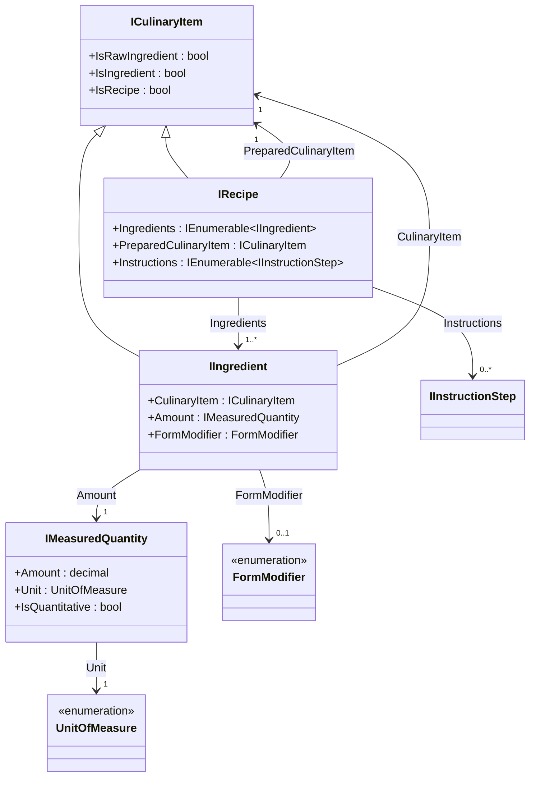

```mermaid
classDiagram
    %% Base Interface First (for clean inheritance lines)
    class ICulinaryItem {
        +IsRawIngredient : bool
        +IsIngredient : bool
        +IsRecipe : bool
    }

    class IRecipe {
        +Ingredients : IEnumerable~IIngredient~
        +PreparedCulinaryItem : ICulinaryItem
        +Instructions : IEnumerable~IInstructionStep~
    }

    class IIngredient {
        +CulinaryItem : ICulinaryItem
        +Amount : IMeasuredQuantity
        +FormModifier : FormModifier
    }

    class IMeasuredQuantity {
        +Amount : decimal
        +Unit : UnitOfMeasure
        +IsQuantitative : bool
    }

    class IInstructionStep

    %% Enums
    class UnitOfMeasure {
        <<enumeration>>
    }

    class FormModifier {
        <<enumeration>>
    }

    %% Inheritance
    ICulinaryItem <|-- IRecipe
    ICulinaryItem <|-- IIngredient

    %% Associations
    IRecipe --> "1..*" IIngredient : Ingredients
    IRecipe --> "0..*" IInstructionStep : Instructions
    IRecipe --> "1" ICulinaryItem : PreparedCulinaryItem

    IIngredient --> "1" ICulinaryItem : CulinaryItem
    IIngredient --> "1" IMeasuredQuantity : Amount
    IIngredient --> "0..1" FormModifier : FormModifier

    IMeasuredQuantity --> "1" UnitOfMeasure : Unit
```
