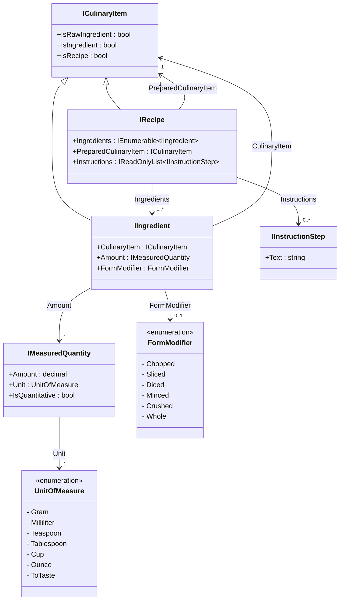
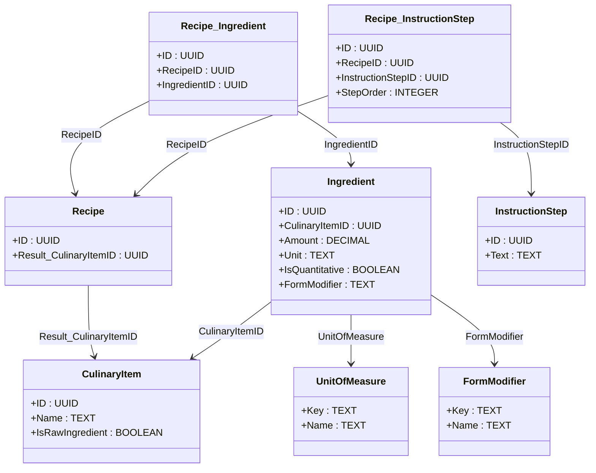

# 🍽️ MVP Business Objects

This document defines the core business rules and structural model for the foundational objects in the recipe system.

---

## 🧠 Business Rules

### CulinaryItem
> A **CulinaryItem** is any discrete food-related object—raw or prepared—that can appear in a recipe system.

### Ingredient
> A **CulinaryItem becomes an Ingredient** only when it is included in a Recipe with a **specific amount** and **modification to its natural form factor** if needed for the Recipe.

### RawIngredient
> A **RawIngredient** is a `CulinaryItem` that cannot be broken down into other `CulinaryItems` within the system. It is considered atomic and is not the output of any defined `Recipe`.

### Ingredient
> A **CulinaryItem becomes an Ingredient** only when it is included in a Recipe with a **specific amount** and **modification to its natural form factor** if needed for the Recipe.

### FormModifier
> A **FormModifier** is a change applied to a `CulinaryItem` that **does not alter its modular identity level**, but instead adjusts its **physical form** for use in a Recipe. It excludes any modification that involves **heat, time-based transformation, or chemical change**.

### Recipe
> A **Recipe** is a transformation rule that takes one or more **CulinaryItems** as **Ingredients**, follows a **defined sequence** of **InstructionSteps**, and produces a **single new CulinaryItem** as the result.

### MeasuredQuantity
> A **MeasuredQuantity** is a structured expression that defines **how much** of a `CulinaryItem` is used, expressed through a **recognized unit of measure**, and may be either **quantitative or qualitative** in nature.

### InstructionStep
> An **InstructionStep** is a **discrete, actionable directive** that contributes to **producing a prepared CulinaryItem**.

---

## 🧰 MVP User Functionality

### ✅ Users can:

- **Create Recipes**
  - Define a recipe name (CulinaryItem)
  - Select one or more existing CulinaryItems as Ingredients
  - Assign a MeasuredQuantity and optional FormModifier to each Ingredient
  - Add a sequence of plain-text InstructionSteps

- **View Recipes**
  - See the Ingredients (with amounts and forms)
  - See the InstructionSteps in defined order
  - View what the recipe produces (CulinaryItem)

- **Browse CulinaryItems**
  - Discover items by name
  - See whether an item is used as an Ingredient, produced by a Recipe, or a RawIngredient

- **Reuse Items**
  - Reference existing CulinaryItems across multiple recipes
  - Build recipes using outputs of other recipes as inputs

---

## 🧩 UML Diagram

---

## 🗂️ Database UML

