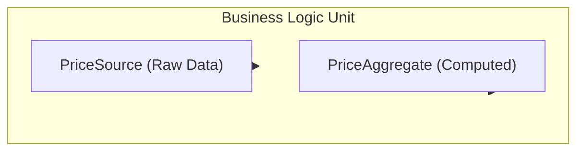
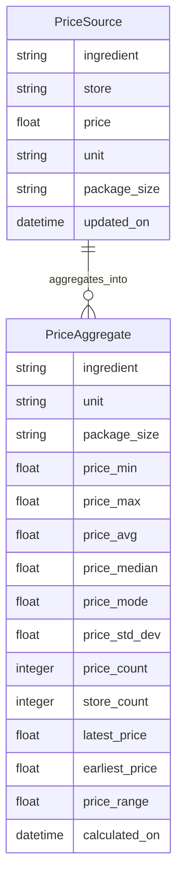

# 🧮 Price Aggregator Architecture

This document defines the `PriceAggregator` business logic unit, its behavior, dependencies, data structures, and integration flow.

---

## 🔧 Overview

**Unit Name**: `PriceAggregator`

**Type**: Business Logic Unit (Microservice)

**Purpose**:  
Consolidates raw price entries from various sources (e.g., Kroger, Amazon Fresh, User) into a unified, deduplicated format per ingredient and package type.

---

## 📥 Inputs and 📤 Outputs

### 📥 Input Source

From: `PriceSource` Table  
> This is a raw ingestion table containing every known price record for ingredients.

### 📤 Output Target

To: `PriceAggregate` Table  
> This is a filtered and computed table providing min/max/avg pricing for each unique product offering.

---

## 🧪 Logic Flow Diagram

---

## 🗃️ Entity Relationship Diagram (ERD)

---

## 📊 Example

### 📥 Input: `PriceSource`

| Ingredient | Store         | Price | Unit  | Package Size | Updated On           |
|------------|---------------|-------|-------|---------------|-----------------------|
| EGG       | Kroger        | 6.00  | each  | 12            | 2025-06-14 10:00 AM   |
| EGG       | Amazon Fresh  | 5.00  | each  | 12            | 2025-06-14 10:01 AM   |
| EGG       | Kroger        | 2.00  | each  | 6             | 2025-06-14 10:02 AM   |

---

### 📤 Output: `PriceAggregate`

| Ingredient | Unit  | Package Size | Min Price | Max Price | Avg Price | Median Price | Mode Price | Std Dev | Price Count | Store Count | Latest Price | Earliest Price | Price Range | Calculated On        |
|------------|-------|---------------|-----------|-----------|-----------|---------------|-------------|----------|--------------|--------------|----------------|------------------|--------------|-----------------------|
| EGG       | each  | 12            | 5.00      | 6.00      | 5.50      | 5.50          | 5.00        | 0.50     | 2            | 2            | 5.00           | 6.00             | 1.00         | 2025-06-14 13:00:00Z  |
| EGG       | each  | 6             | 2.00      | 2.00      | 2.00      | 2.00          | 2.00        | 0.00     | 1            | 1            | 2.00           | 2.00             | 0.00         | 2025-06-14 13:00:00Z  |

---

## 📌 Notes

- The **PriceAggregator** is the *only* unit allowed to touch `PriceSource` directly for core computation.
- All other business logic units must consume from the **PriceAggregate** table.
- Timestamp fields:
  - `updated_on`: When the price source entry was collected.
  - `calculated_on`: When the price aggregate record was last calculated.
